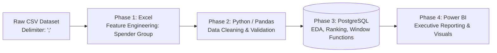

# Customer Behavior Analytics & Segmentation

[](https://www.python.org/)
[](https://www.postgresql.org/)
[](https://powerbi.microsoft.com/)
[](https://www.microsoft.com/excel)

An end-to-end data analytics project evaluating 350 customer profiles to analyze spending concentration, demographic drivers, retention risks, and behavioral segments using Excel, Python, PostgreSQL, and Power BI.

---

## Executive Dashboard Preview


---

## Workflow Architecture



---

## Key Performance Indicators (KPIs)

| Total Gross Revenue | Active Customer Base | Average Satisfaction | Average Recency | Top Revenue Market |
| --- | --- | --- | --- | --- |
| **$5.79M** | **350 Users** | **4.02 / 5.0** | **27 Days** | **Chicago (43%)** |

---

## Core Findings & Visual Analytics

### 1. Revenue Concentration (Pareto Principle)

* **Finding:** High Spenders represent **50% of the customer base but account for ~81% of total gross revenue**.
* **Demographics:** The **Age 41+** cohort delivers the highest revenue per customer, while **female customers contribute ~60%** of total revenue.

### 2. Retention & Churn Vulnerability

* **Churn Metric:** **26.6% of customers are identified as high churn risk** (inactivity > 30 days combined with average rating < 4.0).
* **Correlation:** Extended inactivity intervals directly correlate with declining customer satisfaction scores.

### 3. Promotional Exposure

* **Discount Utilization:** **62% of all recorded transactions** had a promotional discount applied, indicating high price sensitivity across segments.

---

## Data Pipeline & Engineering Steps

### Phase 1: Excel Feature Engineering

Classified customer spending tiers using nested logical formulas prior to database ingestion:

* **`High Spender`** | **`Medium Spender`** | **`Low Spender`**

### Phase 2: Python Data Cleaning & Validation (Pandas)

```python
import pandas as pd

# Load dataset with custom delimiter
df = pd.read_csv("data/raw/customer_data_raw.csv", sep=";")

# 1. Scale Normalization (Resolving single-digit entry errors on a 1-50 base)
df["Average Rating"] = df["Average Rating"].apply(lambda x: x * 10 if x < 10 else x)

# 2. Categorical and Numerical Imputation
categorical_cols = ["Gender", "City", "Membership Type", "Satisfaction Level"]
df[categorical_cols] = df[categorical_cols].fillna("Unknown")
df["Average Rating"] = df["Average Rating"].fillna(df["Average Rating"].median())

# 3. Business-Logic Deduplication
subset_cols = ["Age", "City", "Items Purchased", "Satisfaction Level", "Membership Type", "Average Rating"]
df = df.drop_duplicates(subset=subset_cols)

```

### Phase 3: PostgreSQL Analytical Queries

```sql
-- Churn Risk Identification Query
SELECT 
    customer_id,
    city,
    membership_type,
    total_spend,
    days_since_last_purchase,
    average_rating,
    DENSE_RANK() OVER (PARTITION BY city ORDER BY total_spend DESC) AS city_spend_rank
FROM customer_analytics
WHERE days_since_last_purchase > 30 
  AND average_rating < 4.0
ORDER BY total_spend DESC;

```

---

## Strategic Business Recommendations

> [!IMPORTANT]
> **Priority 1: High Spender VIP Protection Program**
> Protect the top 50% spender tier responsible for 81% of revenue through personalized account management, exclusive loyalty perks, and dedicated customer support channels.

> [!WARNING]
> **Priority 2: Automated Churn Win-Back Funnel**
> Implement automated email/push notifications offering tailored incentives for customers reaching the **30-day inactivity threshold** to prevent sentiment degradation.

> [!TIP]
> **Priority 3: Bronze-to-Gold Upsell Strategy**
> Bronze membership generates the highest aggregate gross revenue due to volume. Create targeted tier-upgrade campaigns with tier-exclusive perks to boost margin conversion.

---

## Repository Structure

```text
.
├── data/
│   ├── raw/                         # Raw CSV input data
│   └── processed/                   # Cleaned and normalized datasets
├── notebooks/
│   └── 01_data_cleaning.ipynb       # Python data cleaning pipeline
├── sql/
│   ├── 01_eda_aggregations.sql      # Basic exploratory queries
│   ├── 02_customer_segmentation.sql # Segmentation and CASE WHEN logic
│   └── 03_window_functions.sql      # Ranking and partition analysis
├── dashboards/
│   └── customer_behavior_bi.pbix    # Power BI dashboard file
├── assets/
│   └── dashboard_preview.png        # Dashboard screenshot preview
└── README.md                        # Documentation

```

---

## Instructions to Reproduce

1. **Clone repository:**
```bash
git clone [https://github.com/ChenStormtout/data-analytics-portfolio.git](https://github.com/ChenStormtout/data-analytics-portfolio.git)
cd data-analytics-portfolio/Customer-Behavior

```


2. **Execute Python data cleaning:**
```bash
pip install pandas numpy

```


3. **Run SQL queries:**
Import `data/processed/customer_data_cleaned.csv` into PostgreSQL and run queries in `/sql`.
4. **View Visualizations:**
Open `/dashboards/customer_behavior_bi.pbix` in Power BI Desktop or inspect `/assets/dashboard_preview.png`.


