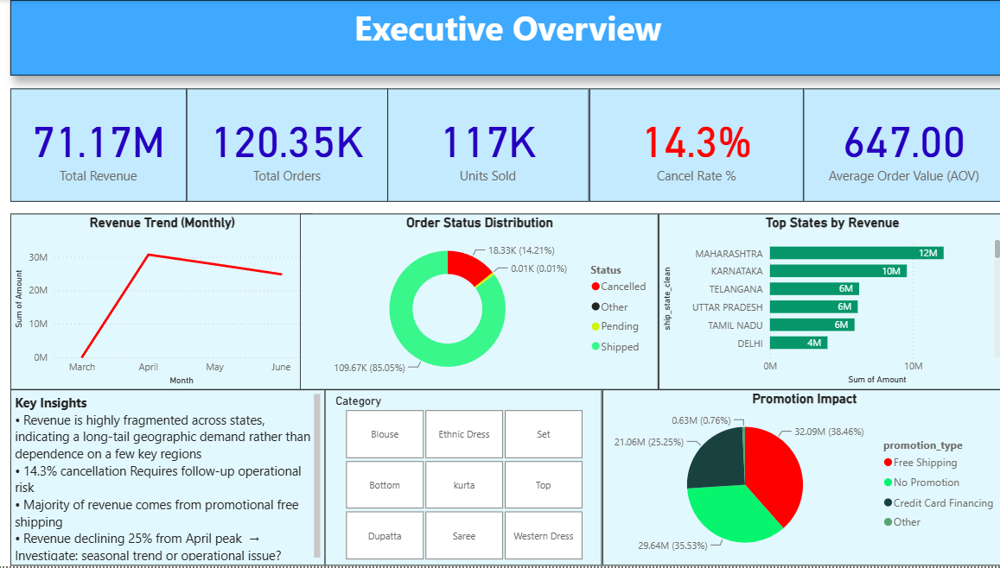
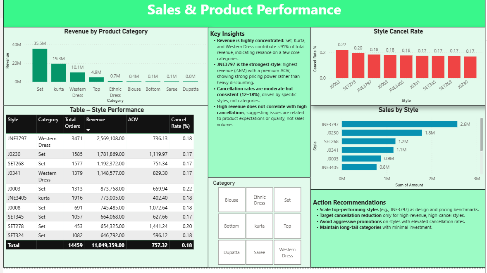
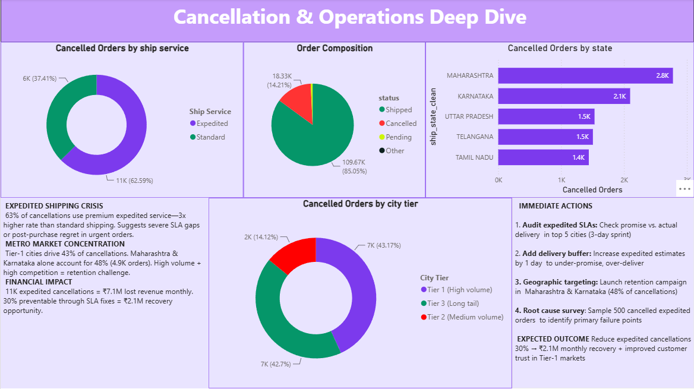

# Amazon India E-Commerce Analytics: Revenue Attrition & Logistics Optimization


An executive-ready analytics case study diagnosing **revenue leakage, SLA bottlenecks, and fulfillment inefficiencies** across 120,000+ transaction records from Amazon India. 

Includes an automated ETL pipeline (Power Query M & Python) and a 3-page interactive Power BI dashboard designed for C-suite decision-making.

---

## Executive Summary & Core Financials

Despite generating **₹71.17M in top-line GMV** across **120.35K orders**, the platform suffers from a **14.3% order cancellation rate**—representing over **₹7.1M in monthly lost revenue**. 

Analysis reveals that cancellation is **not a product quality issue, but an operational SLA failure**: 62.6% of all cancellations occur on premium *Expedited Shipping* orders, concentrated heavily in Tier-1 metro markets.

```
       TOTAL REVENUE            TOTAL ORDERS            UNITS SOLD            CANCEL RATE              AOV
        ₹71.17M                 120.35K                 117.00K                 14.30%              ₹647.00
```

---

## 1. Business Context & Data Engineering Challenges

Ingesting multi-channel e-commerce logs typically introduces schema drift and geographical fragmentation. The primary objective was converting noisy transactional logs into an audit-ready, low-latency dimensional model.

### Primary Data Quality Issues Handled:
1. **High-Cardinality Geographic Noise:** Over 2,000+ distinct spelling errors, casing inconsistencies, and local state abbreviations (e.g., `BENGALURU` vs `BANGALORE`, `BOM` vs `MUMBAI`).
2. **Unstructured Promotional Strings:** Nested promotion identifiers required string parsing to separate Free Shipping, Credit Card Financing, and seasonal discounts.
3. **Imputed Cancelled Transaction Values:** Null/zero amounts on non-fulfilled states were reconciled against unit list prices to quantify true lost gross merchandise value (GMV).

---

## 2. ETL Architecture & Star Schema Modeling

To ensure sub-second visual interactivity in Power BI without relying on full-table scans, flat transaction logs were converted into a Star Schema.

```text
               +--------------------+
               |    dim_date        |
               +--------------------+
                         |
                         | 1:N
                         v
+------------------+   +---------------------------+   +--------------------+
|  dim_geography   |-->|   fct_sales_transactions  |<--|    dim_product     |
+------------------+ 1:N +---------------------------+ 1:N +--------------------+
                         ^
                         | 1:N
               +--------------------+
               |  dim_fulfillment   |
               +--------------------+
```

### Data Normalization Matrix (Power Query M + Python)

| Dimension Field | Raw Input Anomalies | ETL Normalization Logic | Output Standard |
| :--- | :--- | :--- | :--- |
| `ship-city` | `mumbai`, `BOM`, `BOMBAY` | Regex whitespace strip $\rightarrow$ Proper Case $\rightarrow$ Mapping Dict | `MUMBAI` |
| `ship-state` | `PB`, `PUNJAB`, `Punjab state` | Fuzzy matching + state code lookup table | `PUNJAB` |
| `Amount` | `null` on cancelled orders | Conditional imputation based on `Status` flag | `0.00` / `Float` |
| `Promotion-IDs` | `IN2020-09-FREE`, `CC-DISCOUNT` | Delimiter split & categorization logic | `promotion_type` Flag |

---

## 3. Deep-Dive Analytical Findings

### A. The Expedited Shipping Paradox (Core Logistics Bottleneck)
* **High-Urgency Regret:** **62.59% of all cancelled orders (11K orders)** were placed via **Expedited Shipping**, compared to only 37.41% on Standard Shipping. 
* **SLA Failure:** Customers selecting expedited delivery expect rapid fulfillment. Unmet delivery promises drive immediate cancellations prior to dispatch.
* **Geographic Focus:** **43.17% of cancellations originate from Tier-1 Metro Cities**, with Maharashtra (2.8K cancelled) and Karnataka (2.1K cancelled) accounting for **48% of total order drop-off**.

### B. Catalog Pareto Concentration
* **Revenue Drivers:** **91% of total top-line GMV** is generated by just 3 categories: **Set (₹35.5M)**, **Kurta (₹19.3M)**, and **Western Dress (₹10.1M)**.
* **Top Performing Style:** `JNE3797` (Western Dress) leads total product revenue at **₹2.57M** (3,471 orders, AOV ₹736.13).
* **Cancellation Uniformity:** Style-level cancellation rates remain tightly clustered between **17% – 22%** across top revenue items, reinforcing that product defects are not the driver—logistics and SLA delays are.

### C. Promotional Elasticity
* **Discount Dependence:** **63.7% of total revenue** is tied directly to promotions—led by **Free Shipping (₹32.09M / 38.5%)** and **Credit Card Financing (₹21.06M / 25.3%)**. Unpromoted sales represent only ₹29.64M (35.5%).

---

## 4. Dashboard Architecture & Visual Analytics

The Power BI report is divided into three executive reporting views:

### Page 1: Executive Overview
> High-level GMV tracking, revenue burn rates, state-level demand maps, and promotion mix breakdown.



---

### Page 2: Sales & Product Performance
> Category concentration analysis, style velocity rankings, price-elasticity insights, and style cancellation rates.



---

### Page 3: Cancellation & Operations Deep Dive
> Root-cause operational diagnostic focusing on shipping SLA failures, city tier vulnerabilities, and revenue recovery modeling.



---

## 5. Strategic Action Matrix & Financial Recovery Roadmap

| Priority | Operational Initiative | Tactical Action | Expected Financial Impact |
| :---: | :--- | :--- | :--- |
| **P1** | **Audit Expedited Delivery SLAs** | Implement a 1-day safety buffer on expedited delivery estimates in top Tier-1 cities to align customer expectations. | **Recovers ~₹2.1M/month** (30% reduction in preventable expedited cancellations). |
| **P2** | **Tier-1 Carrier Optimization** | Partner with localized regional carriers in Maharashtra & Karnataka to reduce pre-dispatch transit time. | Protects **₹4.9K orders** from drop-off risk. |
| **P3** | **Inventory Allocation Strategy** | Reallocate high-velocity SKUs (`JNE3797`, `J0230`, `SET268`) closer to Tier-1 fulfillment hubs. | Reduces out-of-stock risk and fulfillment lag on 91% of top-line revenue. |

---

## 6. Repository Navigation

```text
.
├── bi_reports/
│   └── amazon_sales_dashboard.pbix    # Complete 3-page interactive Power BI file
├── power_query/
│   └── transformation_scripts.m       # Reusable M-code for automated ingestion
├── python/
│   └── data_audit_and_cleaning.py     # Pandas scripts for data quality checks
├── sql/
│   └── analytical_queries.sql         # SQL queries for exploratory data analysis
├── assets/
│   ├── dashboard_overview.png         # Executive Overview screenshot
│   ├── dashboard_product.png          # Sales & Product Performance screenshot
│   └── dashboard_operations.png       # Operations Deep Dive screenshot
└── README.md
```
